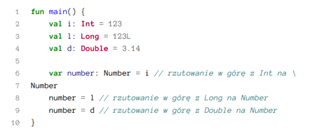

# Kotlin Podstawy

> This repository is a translation of the book Kotlin Essentials by Marcin Moskała

## Tłumaczenie

Jest to tłumaczenie książki Kotlin Essentials autorstwa Marcina Moskały. Zostało ono poprowadzone w następujący sposób:
* pierwotnego tłumaczenia dokonał Peter Armstrong przy użyciu ChatGPT,
* następnie autor, Marcin Moskała, dokonał poprawek,
* wreszcie poprawą języka zajęli się członkowie społeczności Kotlin w ramach kontrybucji do tego projektu.

## Organizacja książki

Tekst książki znajduje się w folderze `manuscript`. Każdy rozdział jest oddzielny plikem w formacie Markua (modyfikacja Markdown dedykowana do pisania książek). Wszystkie obrazki znajdują się w folderze `resources`. Linki do obrazków w tekście nie zawierają przedrostka `resources/`. Książka jest generowana na podstawie tych źródeł przez LeanPub

## Dostępność książki

Książka będzie dostępna w następujących formatach:
* fizyczna książka w księgarniach internetowych i na Allegro,
* ebook na LeanPub,
* ebook na Amazon Kindle,
* jako artykuły opublikowane na Kt. Academy. 

## Instrukcje dla korektorów

Jeśli chcesz pomóc w tłumaczeniu, możesz:
* osobiście przejrzeć tekst w foderze `manuscript` i zasugerowac zmiany poprzez Pull Request
* przejrzeć zgłoszone błędy w zakładce [Issues]().

Instrukcje dla korektorów:
* **Nie bój się** - jeśli widzisz błąd, zgłoś go, nawet jeśli jest mały.
* **Nie ograniczaj się do konkretnego rozdziału** - jeśli widzisz błąd w jednym miejscu, sprawdź, czy nie występuje on również w innych miejscach.
* **Rozdzielaj PRy** - jeśli nie masz pewności że pewna zmiana zostanie przyjęta dobrze, zrób to w osobnych PRach. Nie musisz czekać na zatwierdzenie PRa, aby zrobić kolejny. Nie pozwól na to, aby gromadziło się zbyt dużo zmian na twoim lokalnym branchu, by uniknąć konfliktów.
* **Nie bój się wprowadzać odważne zmiany językowe** - nie ograniczaj się do poprawiania literówek. Jeśli widzisz, że jakiś fragment jest niejasny, spróbuj go przetłumaczyć na inny sposób. Jeśli widzisz, że jakiś fragment jest niejasny, spróbuj go przetłumaczyć na inny sposób. 
* **Książka powinna być spójna z orginałem** - nie wprowadzaj zmian w kodzie oraz nie zmieniaj struktury książki. Jeśli widzisz coś istotnego do poprawy, otwórz issue i przypisz do niego Marcina Moskałę. 

By upewnić się, że każdy rozdział uzyska odpwiednią liczbę korektorów, proszę o przypisanie się do konkretnego rozdziału w zakładce [Issues](). Każdy z rozdziałów musi przejść korektę co najmniej pięciu osób.

Kod spushowany do brancha `master` jest automatycznie publikowany na LeanPub, a więc zmiany są widoczne przez wszystkich czytelników. Recenzenci powinni dostać dostęp do książki na LeanPub, aby móc zawsze sprawdzić, jak wygląda książka w formacie ebook.

#### Format

Wszystkie fragmenty kodu **muszą** się mieścić w 62 znakach szerokości, bo inaczej prowadzi to do brzydkiego ucinania linii. 



Obrazki powinny mieć określoną szerokość w % poprzez użycie atrybutu `width`.

```
{width: 50%}

```

#### Spójność

**Podjąłem decyzję, że nadrzędna nad poprawnością językową powinna zrozumiałość!** Książka powinna być możliwie pisana tak, jak komunikują się programiści. Zamiast więc pisać "łacychy znaków", powinny być "stringi", a zamiast "celów kompilacji" powinny być "targety". 

Na ten moment przyjąłem następujące tłumaczenia pojęć z języka angielskiego:
* **annonymous function** - **funkcja anonimowa**,
* **companion object** - **companion object**,
* **conditional statement** - **instrukcja warunkowa**,
* **data class** - **klasa data**,
* **enum class** - **enum**,
* **expression** - **wyrażenie**,
* **function literal** - **literał funkcyjny**,
* **if-expression** - **wyrażenie if**,
* **lambda expression** - **wyrażenie lambda**,
* **object expression** - **wyrażenie obiektu**,
* **reference** - **referencja**,
* **sealed class** - **klasa sealed**,
* **statement** - **instrukcja**,
* **string** - **string**,
* **string interpolation** - **interpolacja stringa**,
* **string literal** - **literał stringa**,
* **string template** - **szablon stringa**,
* **target** - **target**,
* **try-catch expression** - **wyrażenie try-catch**,
* **when-expression** - **wyrażenie when**,
* **call** - **wywołanie**,

Jestem otwarty na wszelkie propozycje zmian. 
Dodawajcie proszę inne nieoczywiste tłumaczenia. 

#### Odmiana

Odmieniamy nazwy języków np:
* **Java** - **Javie**,
* **Kotlin** - **Kotlinie**,
* **JavaScript** - **JavaScripcie**

#### Formy męskie i żeńskie

Unikamy form męskich i żeńskich stosujemy raczej zwroty bezpośrednio do czytelnika albo użwając liczby mnogiej (np "programiści" zamiast "programista").

Przy zwrotach do czytelnika, używamy wielkich liter, jak w listach (np "Twój", "Twoje", "Ciebie"). Nie jest to standardowa praktyka, ale uważam, że jest to miłe dla czytelnika. 

#### Inne pytania

Jeżeli masz pytanie, na które nie znalazłeś/łaś odpowiedzi w powyższym tekście to możesz je również dodać w zakładce Issues, tak aby inni pracujący na dokumencie mogli się wypowiedzieć.
